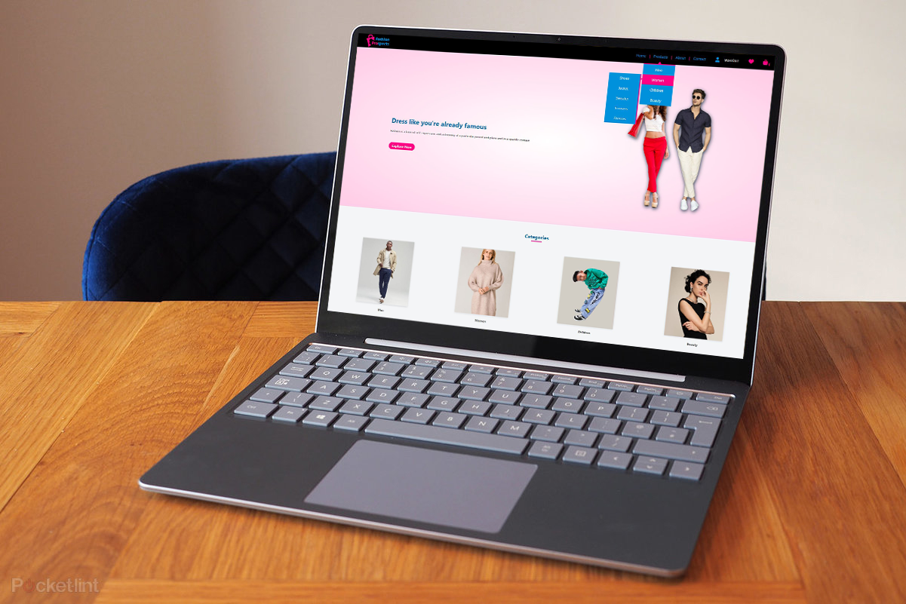

# Fashion Prospects

## 1. Description

This app helps the freelance chefs to post their meals and sale them online.
Our registered clients can order the meals they want or choosing a specific chef to order from according to his rate or cuisine.
The guest user can have overview about our app also but with a limited permissions.

## 2. Usage

- User (guest) can overview the app.
- User must create an account to add product to favorite and order.
- User can edit and update his profile.
- Ability to see your last visited product.
- Viewing the product details.
- Finding top 4 rated products.
- Able to view the latest 10 products in slider.
- Admin can (add, edit and delete) product.</br>

To experience the feature of be an admin try to Login using:</br>
E-mail: admin@productProspects.com</br>
Password: asdasdA1!

## 3. Link and Preview


Project link is available at [Fashion Prospects App](https://c38-group2.herokuapp.com/)

### Color guide


## 4. Built with


## 5. Setup

First, to setup all the directories run the following in the main directory:

Run the command `npm install` at the server, client and main root.

In the `main` directory there is one `.env` file only.

To run the app in dev mode you can run the following command in the main directory:

`npm run dev`

## 6. Code structure

```
client
└── public
    └── images
    └── index.html
└── src
    └── assets
    └── components
        └── AddToFavorite.vue
        └── AddToShoppingCart.vue
        └── Carousel.vue
        └── CarouselSlide.vue
        └── Category.vue
        └── CategoryCard.vue
        └── DeleteFromCart.vue
        └── EditAndDeleteProduct.vue
        └── EditProfile.vue
        └── ExclusiveProduct.vue
        └── FeaturedProducts.vue
        └── Footer.vue
        └── HeroSection.vue
        └── LatestProducts.vue
        └── LoginForm.vue
        └── NavBar.vue
        └── ProductCard.vue
        └── ProductRate.vue
        └── ProductShoppingCart.vue
        └── SignUpForm.vue
        └── Spinner.vue
        └── VisitedProducts.vue
    └── modules
        └── user.js
    └── router
        └── index.js
    └── views
        └── About.vue
        └── Auth.vue
        └── CategoryPage.vue
        └── Contact.vue
        └── CreateProduct.vue
        └── CreateSubCategory.vue
        └── EditProduct.vue
        └── Favorite.vue
        └── Home.vue
        └── ProductDetails.vue
        └── ProductPage.vue
        └── Profile.vue
        └── ShoppingCart.vue
    App.vue
    main.jsx
server
└── src
    └── controllers
        └── category.js
        └── product.js
        └── shoppingCart.js
        └── subCategory.js
        └── user.js
    └── db
        └── connectDB.js
    └── models
        └── Category.js
        └── Product.js
        └── SubCategory.js
        └── User.js
    └── routes
        └── category.js
        └── product.js
        └── subCategory.js
        └── user.js
    └── util
        └── logging.js
        └── validateAllowedFields.js
        └── validationErrorMessage.js
    app.js
    index.js
README.md
```
